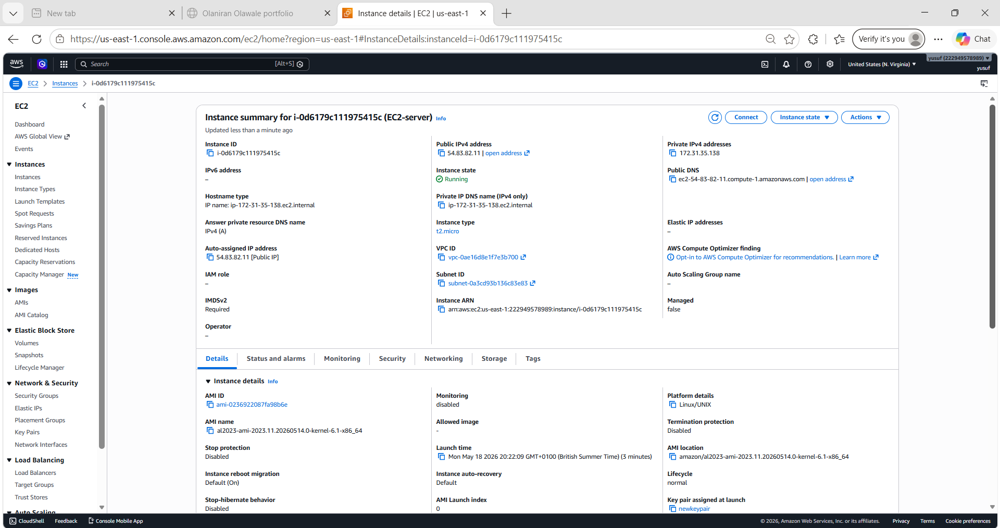
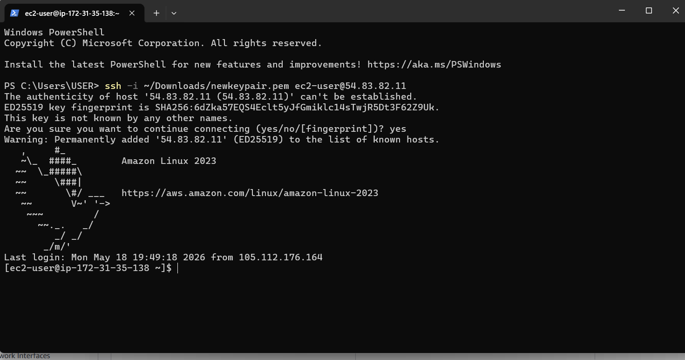
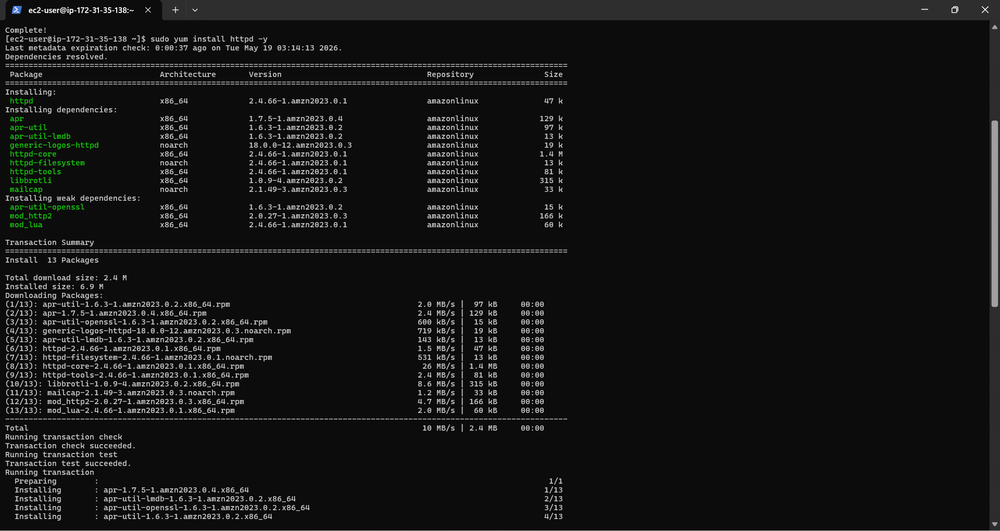
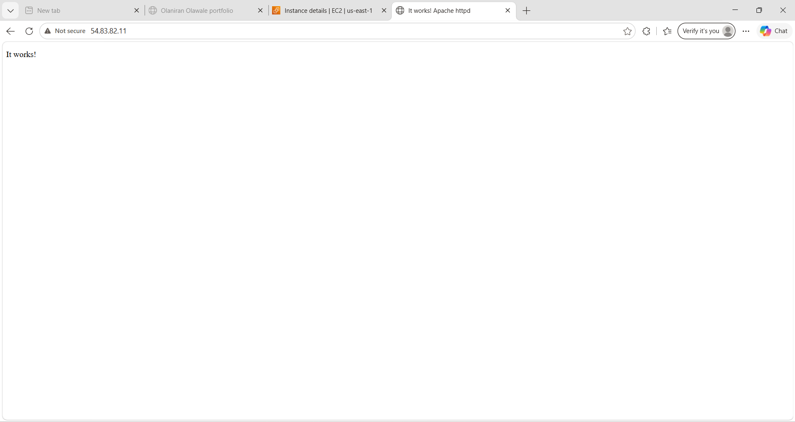
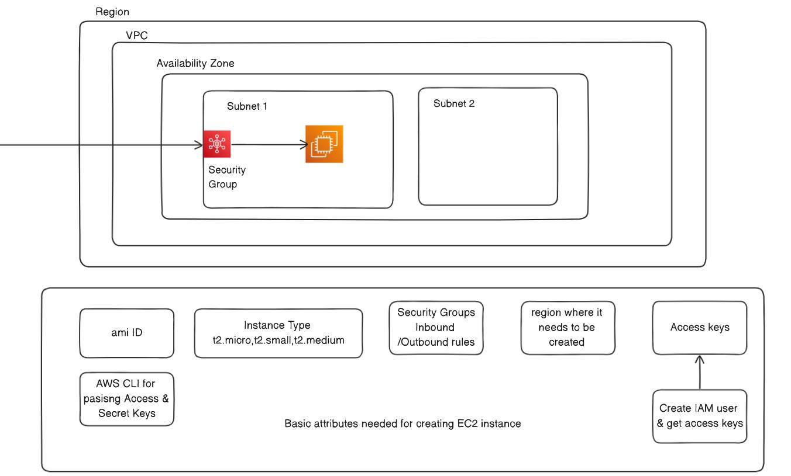
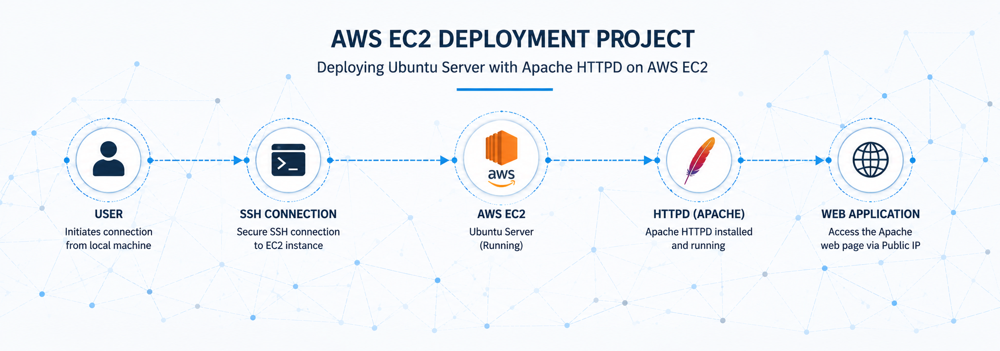

# AWS EC2 Deployment portfolio

## Project Overveiw

This project demonstrates the deployment and configuration of an Aws Ec2 Amazon linux server instance . The project include ssh connectivity , configuration of iux server, httpd installation, and web server hosting.

## Technologies used

- AWS EC2 
- Amazon linux
- SSH
- Httpd
- Git and Github 

## Deployment process 

### step 1 - launch EC2 Instance 

An Amazon linux EC2 instance was cfreated using AWS console.

### step 2 - Configure security groups 

Allowed 
- SSH (port 22)
- HTTP (port 80)

## step 3 - connect via SSH 

#!/bin/bash

- SSH -i ~/Downloads/newkeypair.pem ec2-user@54.83.82.11

## step 4 - install httpd

#!/bin/bash

- sudo yum update
- sudo yum install httpd -y
- sudo systemctl start httpd
- sudo systemctl enable httpd

## step 5 - test web server

htpp://54.83.82.11

sucessfully displayed it works 

## Screenshots

### EC2 Instance Launch

### SSH Login

### httpd Installation

### Web Server Running

## Assets

## Skills Demonstrated

- Cloud Computing
- Linux Administration
- AWS EC2 Deployment
- SSH Networking
- Web Server Configuration
- Git Version Control

## Future Improvements

- Add HTTPS with SSL
- Deploy a Node.js application
- Configure Load Balancer
- Use Docker containers

## Author

OLANIRAN OLAWALE EMMANUEL

GitHub:
https://github.com/CLOUDMAN792